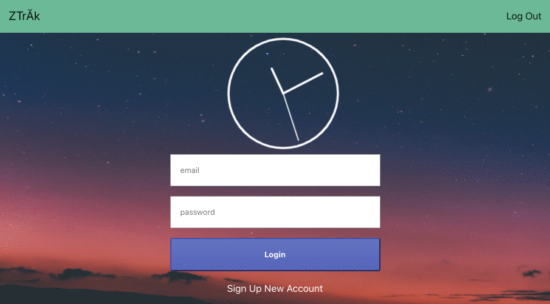
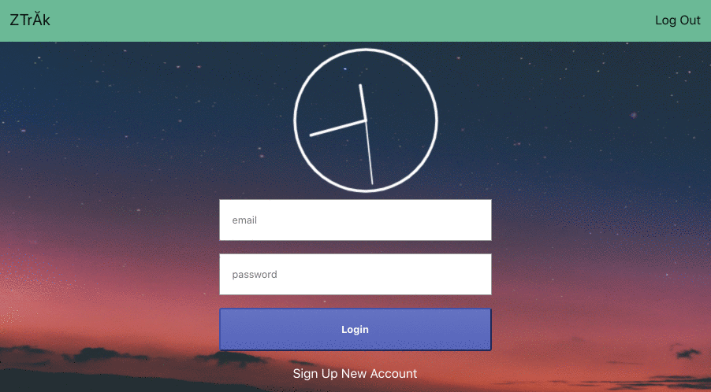
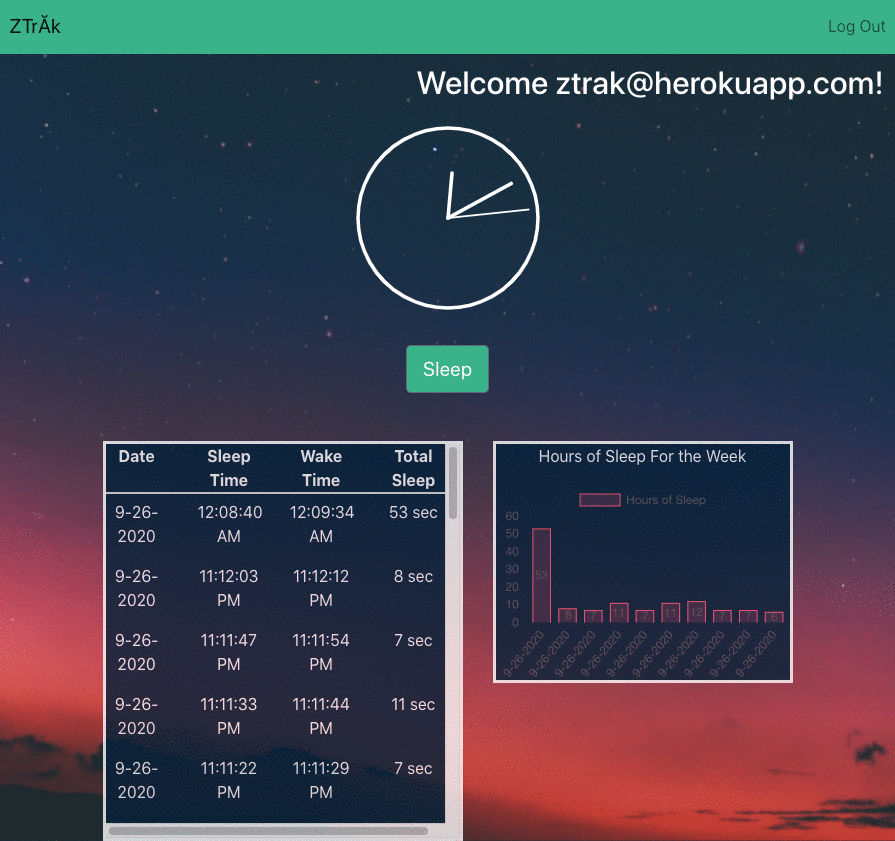
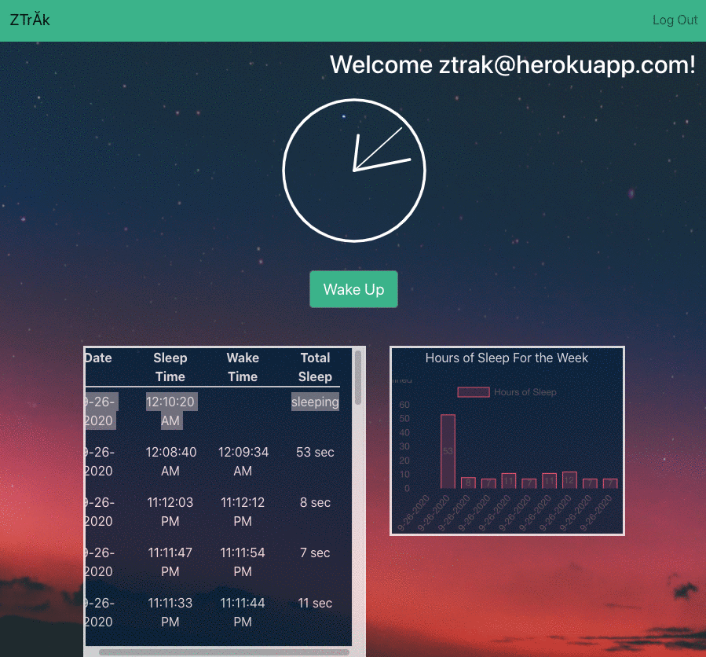

# ZTrak

## About
ZTrak  is a sleep tracking app for logging and displaying sleep times and length. The purpose of the app is to understand your bedtime patterns with detailed sleep tracking tables and graphs. Tracking your sleeping patterns means you can wake up feeling refreshed and ready to start your day.

## User Story
As a user I want to track the time I go to bed and the time I wake up.
I want to see the times along with a total time asleep 
And visualize my sleep duration over time in a graph

**Click** **[here](https://ztrak.herokuapp.com)** **to visit the website!** 
**Demo Login:** 
username: `ztrak@herokuapp.com` 
password: `abc123` 

 

 

## Table of Content

* [Usage](#usage)
* [Credits](#credits)
* [License](#license)

 

 

## Usage

Sign up: 
 
Log in: 
 
Start sleep session: 
 
End sleep session and view history and graph: 
 

 

 

## Credits
`GitHub` | Name 

`kennyqng` | Kenny Nguyen 
`laurengarelick` | Lauren Garelick 
`rogelis` | Rogelio Salgado 
`domenikos5` | Dominador de la Cruz 

 

## License

Copyright (c) [2020] [Kenny Nguyen, Lauren Garelick, Rogelio Salgado, Dominador de la Cruz]

Permission is hereby granted, free of charge, to any person obtaining a copy
of this software and associated documentation files (the "Software"), to deal
in the Software without restriction, including without limitation the rights
to use, copy, modify, merge, publish, distribute, sublicense, and/or sell
copies of the Software, and to permit persons to whom the Software is
furnished to do so, subject to the following conditions:

The above copyright notice and this permission notice shall be included in all
copies or substantial portions of the Software.

THE SOFTWARE IS PROVIDED "AS IS", WITHOUT WARRANTY OF ANY KIND, EXPRESS OR
IMPLIED, INCLUDING BUT NOT LIMITED TO THE WARRANTIES OF MERCHANTABILITY,
FITNESS FOR A PARTICULAR PURPOSE AND NONINFRINGEMENT. IN NO EVENT SHALL THE
AUTHORS OR COPYRIGHT HOLDERS BE LIABLE FOR ANY CLAIM, DAMAGES OR OTHER
LIABILITY, WHETHER IN AN ACTION OF CONTRACT, TORT OR OTHERWISE, ARISING FROM,
OUT OF OR IN CONNECTION WITH THE SOFTWARE OR THE USE OR OTHER DEALINGS IN THE
SOFTWARE.